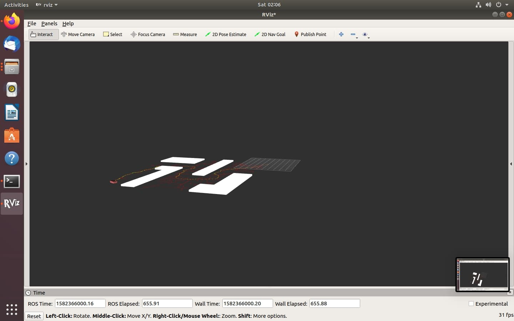

====================================================
**Welcome to Kinodynamic-fast RRT's documentation!**
====================================================

.. toctree::
   :maxdepth: 2
   :caption: Contents
   

Overview
--------

We have implemented the famous path planning algorithm, the **Rapidly-exploring random tree** in **C++** and deployed it using **ROS**. This project was developed as a part of summer research internship at HTIC, IIT-Madras. 

Generally, RRT is used in the mobile robots for path planning and trajectory optimisation. It is based on the concept of graph formation connecting the randomly generated points in the robot's configuration space. 

Objective
---------

Unlike the conventional path planning algorithms RRT has less time complexity. In other words, once the configuration space is sampled it takes less time for the algorithm to find a collision-free path from the start position to the goal position. Space complexity, on the other hand is very high for the algorithm which makes it less suitable for the applications that don't involve any sophisticated hardware like GPU, etc. The space is sampled on the basis of psuedo-random number generator concept which is ineffcient in most of the cases due to memory constraints.

In this project, we have addressed the issue of high space complexity and disscussed a solution to counter the issue as well.

Algorithm 
---------
In path planning, Kinodynamic planning is used to solve tasks that largely depend on the velocity, acceleartion, and torque to be satisfied along with the kinemaic constraints like obstacle avoidance. The concept is based on reducing the time taken by the robot to trace an optimal, collision-free path from the home position to the goal. Kinodynamic planning is primarily used to solve control problems in robotics. 

In our case, the robot employed to test the algorithm was UR5 robotic arm. 

.. figure:: algorithm.png
   :align: center
   
   
   
   **Basic RRT algorithm**
   

Results
-------

We deployed the algorithm in **rviz** visualiser with the help of ROS. The following observations were made:

   **Algorithm in stage 1.**

   **Algorithm in stage 2.**

   
.. figure:: shot3.jpg
   :align: center

   **Algorithm in stage 3.**

.. figure:: shot4.jpg
   :align: center

   **Algorithm in stage 4.**

   **Algorithm in stage 5.**

.. figure:: shot6.jpg
   :align: center

   **Algorithm in stage 6.**

